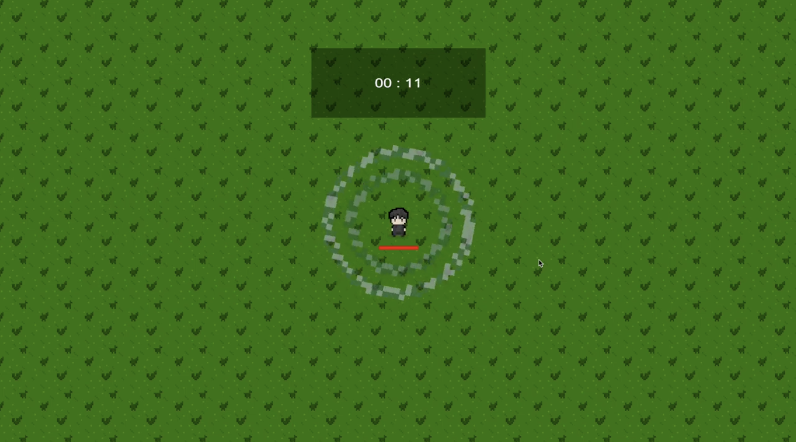
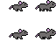
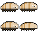
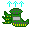
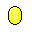
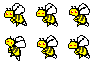
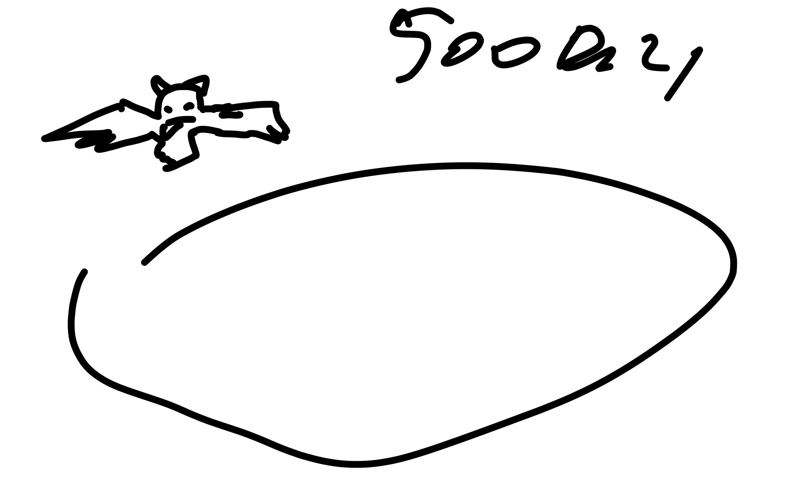
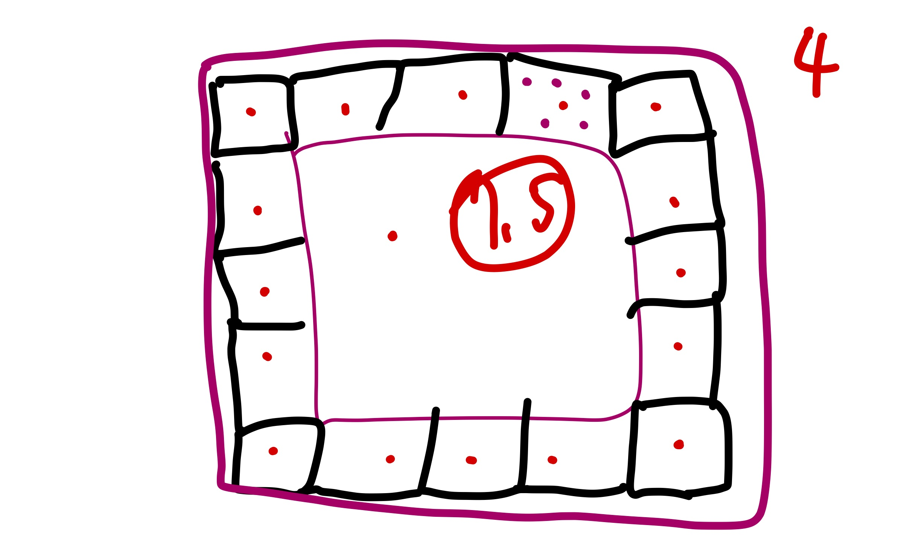

# 🎮 GDP (게임 동계 프로젝트)

  
  

## 📖 프로젝트 개요

**GDP**는 **G**(게임) **D**(동계) **P**(프로젝트)의 약자로, 게임에 흥미를 가진 동아리 부원끼리 단기간에 완성한 창의적인 작품입니다!

## 🎯 게임 장르
**뱀서라이크 (Vampire Survivors-like)** - 자동 공격과 생존을 기반으로 한 액션 RPG

## 📅 개발 기간
**2025.01.09 ~ 2025.02.29**

## 🎥 시연 영상
[📺 게임 플레이 영상 보기](https://youtu.be/w6NejB-W_To?si=z2V16v1xnHqdGtEo)

## 🛠️ 기술 스택
- **게임 엔진**: Unity
- **프로그래밍 언어**: C#
- **개발 도구**: Unity Editor

## 🧩 주요 특징
- **다양한 알고리즘 활용**: 원형큐를 이용한 몹 스폰 알고리즘 구현
- **완전 자체 제작**: 게임 기능 구현부터 캐릭터 & 몹 & 배경 디자인까지 모든 것을 직접 개발
- **IT 테마**: 컴퓨터와 네트워크 관련 요소들을 게임에 창의적으로 적용

## 🎨 게임 에셋

### 👾 적 캐릭터 (Enemy)
**IT 테마에 맞춰 바이러스를 옮기는 동물들을 적으로 선정!** 🦠

| 이미지 | 이름 | 모티브 | 이미지 | 이름 | 모티브 |
|--------|------|---------|--------|------|---------|
|  | **Bat** (박쥐) | 코로나19 |  | **Mouse** (쥐) | 페스트 |
|  | **Bbug** (벌레) | 질병 매개 곤충 |  | **Rabbit** (토끼) | 토끼열병 |
|  | **Cat** (사향고양이) | SARS |  | **Camel** (낙타) | MERS |
|  | **Crow** (까마귀) | 조류독감 |  | **Exp** | 적 처치 시 드롭되는 경험치 오브 |

### 🏃‍♂️ 플레이어 캐릭터 (Player)

  
  

- **생존자 컨셉**: IT 바이러스들과 싸우는 백신 개발자
- **8방향 이동**: 부드러운 방향 전환과 애니메이션
- **캐릭터 애니메이션**: 이동, 사망 등 다양한 상태 표현

### 🔫 무기 시스템 (Weapon)
IT 테마에 맞는 독창적인 백신/보안 무기들:

| 이미지 | 무기명 | 이미지 | 무기명 | 이미지 | 무기명 |
|--------|------|--------|------|--------|------|
|  | **Arrow** (화살) |  | **Pill** (알약) |  | **SpeedUp** (반도체) |
|  | **BlueTooth** (블루투스) |  | **TrashBomb** (휴지통폭탄) |  | **Folder** (폴더) |
|  | **Bug_Black** (버그) |  | **WiFi** (와이파이) |  | **Missile** (미사일) |
|  | **Bug_Red** (버그) |  | **FireWall** (방화벽) |  | **Packet** (디도스) |

### 🎁 아이템 시스템 (Item)
| 이미지 | 아이템명 | 이미지 | 아이템명 | 이미지 | 아이템명 | 이미지 | 아이템명 |
|--------|---------|--------|---------|--------|---------|--------|---------|
|  | **CPU** |  | **DDos** |  | **Bug** |  | **Overflow** |
|  | **RAM** |  | **FireWall** |  | **Arrow** |  | **Pll** |
|  | **HDD** |  | **Ctrl+Z** |  | **Format** | - | - |
|  | **WiFi** |  | **RecycleBin** |  | **LAG** | - | - |
|  | **BlueTooth** |  | **Charge** | - | - | - | - |

### 🗺️ 맵 에셋

  

- **Main_Ground** - 게임 메인 맵 도트 그래픽

## 👥 개발자 정보

- **김인성** ([@Danto7632](https://github.com/Danto7632))
- **심기준** ([@potato1028](https://github.com/potato1028))

## 🎯 주요 구현 내용

### 🔄 알고리즘 활용
- **원형큐 기반 몹 스폰 시스템**: 효율적인 메모리 관리와 스폰 타이밍 제어

### 🎮 뱀서라이크 게임 시스템
- **자동 공격 시스템**: 플레이어는 이동에만 집중, 무기는 자동으로 발사
- **생존 기반 게임플레이**: 끝없이 몰려오는 적들로부터 최대한 오래 생존
- **레벨업 & 성장 시스템**: 경험치 획득으로 능력치 강화 및 새로운 무기 해금
- **다양한 무기 조합**: 여러 무기를 동시에 사용하여 시너지 효과 창출
- **원형큐 기반 적 스폰**: 효율적인 메모리 관리로 대량의 적 처리
- **체력 및 경험치 시스템**: 실시간 상태 관리

### 🎨 비주얼 요소
- **모든 스프라이트 자체 제작**
- **부드러운 애니메이션 구현**
- **IT 테마에 맞는 창의적인 디자인**

## 📚 개발 과정

### 📋 기획 및 회의 자료
`public/images/` 폴더에는 프로젝트 전 과정에서 진행된 개발 회의 자료들이 체계적으로 정리되어 있습니다:

#### **1단계: 초기 아이디어 구상 및 게임 컨셉 설정**
| | | | | |
|---|---|---|---|---|
|  |  |  |  |  |
|  |  |  |  |  |
|  | | | | |

#### **2단계: 상세 기획 및 시스템 설계**
| | | | | |
|---|---|---|---|---|
|  |  |  |  |  |
|  |  |  |  |  |
|  |  |  |  |  |
|  |  |  |  |  |
|  |  |  | | |

#### **3-9단계: 구현, 테스트, 완성**
| | | | | |
|---|---|---|---|---|
|  |  |  |  |  |
|  |  |  |  |  |
|  |  |  |  |  |
|  |  |  | | |

### 🔄 개발 프로세스
1. **기획 단계**: 뱀서라이크 장르 선정 및 IT 테마 결정
2. **설계 단계**: 원형큐 알고리즘을 활용한 몹 스폰 시스템 설계
3. **구현 단계**: Unity와 C#을 활용한 게임 시스템 개발
4. **아트 작업**: 모든 스프라이트 자체 제작 및 애니메이션 구현
5. **테스트 단계**: 게임 밸런스 조정 및 버그 수정
6. **완성**: 최종 빌드 및 시연 영상 제작

## 🌟 프로젝트 의의

GDP는 단순한 게임 개발을 넘어서, **IT 지식을 게임으로 표현**하는 창의적인 도전이었습니다. 
컴퓨터 과학의 다양한 개념들(CPU, RAM, 네트워크, 알고리즘 등)을 게임 요소로 재해석하여 
교육적 가치와 재미를 동시에 추구했습니다.